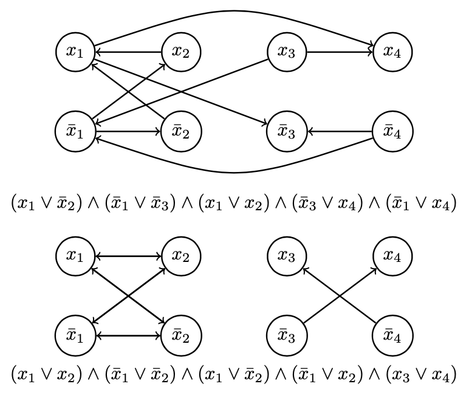

## What's 2-SAT

​	**什么是2-SAT？**该问题可以描述为：给定一个具有若干由两个变元通过析取构成子句所构成的集合，对各子句中两个变元分配布尔值使得所有子句成立。例如：$(x_1 \lor \bar{x}_2) \land (\bar{x}_1\lor \bar{x}_3) \land (x_1 \lor x_2) \land (\bar{x}_3 \lor x_4) \land (\bar{x}_1 \lor x_4)$，其中$\bar{x}_2$表示对$x_2$取反。对于上式(也称为"命题")，我们需要求证：$x_i \in \{0, 1\},\ i \in \{1, 2, 3, 4\}$是否存在命题为真的取值情况。

​	**该问题中的子句还有其他形式的描述方式么？**对于$(\alpha \lor \beta)$可以用$\bar{\alpha} \mapsto \beta$描述（可以通过真值表证明）。此外，我们可以得到如下性质：

1. $\big((\alpha \mapsto \beta) \land (\beta \mapsto \gamma) \big) \mapsto (\alpha \mapsto \gamma)$；
2. $(\bar\alpha \mapsto \beta) \mapsto (\bar\beta \mapsto \alpha)$。

> 枚举真值取值不难发现可以采用$\bar{\alpha} \mapsto \beta$表示$(\alpha \lor \beta)$：
>
> 1. $\alpha = 0, \beta = 0$，则$\bar{\alpha} \mapsto \beta = 0, \bar{\beta} \mapsto \alpha = 0$;
> 2. $\alpha = 0, \beta = 1$，则$\bar{\alpha} \mapsto \beta = 1, \bar{\beta} \mapsto \alpha = 1$;
> 3. $\alpha = 1, \beta = 0$，则$\bar{\alpha} \mapsto \beta = 1 , \bar{\beta} \mapsto \alpha = 1$;
> 4. $\alpha = 1, \beta = 1$，则$\bar{\alpha} \mapsto \beta = 1, \bar{\beta} \mapsto \alpha = 1$.
>
> 以下对性质的理解：
>
> 性质1可表示不同变元在不同子句中仍存在影响；性质2为子句提供了不同变元间的蕴含关系。以上两个性质有利于将该问题表示为图论中的问题，特别是构造边集；同样有利于借助图论中的算法解决2-SAT问题。

通过以上描述方式及性质，不难得到如果命题中同时存在$\bar\alpha \mapsto \alpha$及$\alpha \mapsto \bar{\alpha}$时，命题无解；反之存在某种分配方式使得命题成立。

> 同时存在$\bar\alpha \mapsto \alpha$及$\alpha \mapsto \bar{\alpha}$时，取$\alpha = true$，则有$\bar{\alpha} = true$，得到$\alpha = false$，矛盾；取$\bar{\alpha} = true$，即令$\alpha = false$，则有$\alpha = true$，矛盾。因此，命题中同时存在$\bar\alpha \mapsto \alpha$及$\alpha \mapsto \bar{\alpha}$时，命题无解。

## 2-SAT on Graph

​	**2-SAT问题构造成图**：每个变元构成一个结点，同时将每一个变元的反构造为结点，各结点间的连边关系由蕴含表达式$\bar{\alpha} \mapsto \beta$及性质中的有向关系表示。则2-SAT可由包含变元的顶点集和包含析取关系的边集构建成图。按照该构造关系可得到如下实例：

​	在上述描述下，如何求解2-SAT问题呢？我们已知命题中同时存在$\bar\alpha \mapsto \alpha$及$\alpha \mapsto \bar{\alpha}$时，命题无解。将该问题转化为图论中的问题可以描述为两个结点$\alpha, \bar \alpha$是否相互可达，即结点$\alpha, \bar \alpha$是否同处于一个强连通分量中。至此，只需要调用强连通分量的算法并判断变元即其反是否同处于一个强连通分量之中即可。

> 如果某个sink strongly  connected component中同时出现$x, \bar x$，则与题设矛盾，因此不会同时被赋为true；
>
> 考虑$x, \bar x$是否先后被赋值为true，
>
> 由图的对称性可到，如果选择某个sink strongly connected component中的$x$（或者$\bar x$），那么对应的$\bar x$（或者$x$）必定出现在source connected component中。
>
> 证：如果对应的$\bar x$（或者$x$）不在source connected component中，那么存在某一点$u\mapsto \bar x$（或者$u \mapsto x$），又由图的对称性可以得到，存在$x \mapsto \bar u$（或者$\bar x \mapsto \bar u$）。因此$x$（或者$\bar x$）不可能存在与sink strongly connected component中，矛盾。原命题成立。
>
> 所以每次选择sink中的点后必将选择source中的点，并不会出现，sink中的点的反不存在于source中的情况，因此不会出现重复赋值的情况。